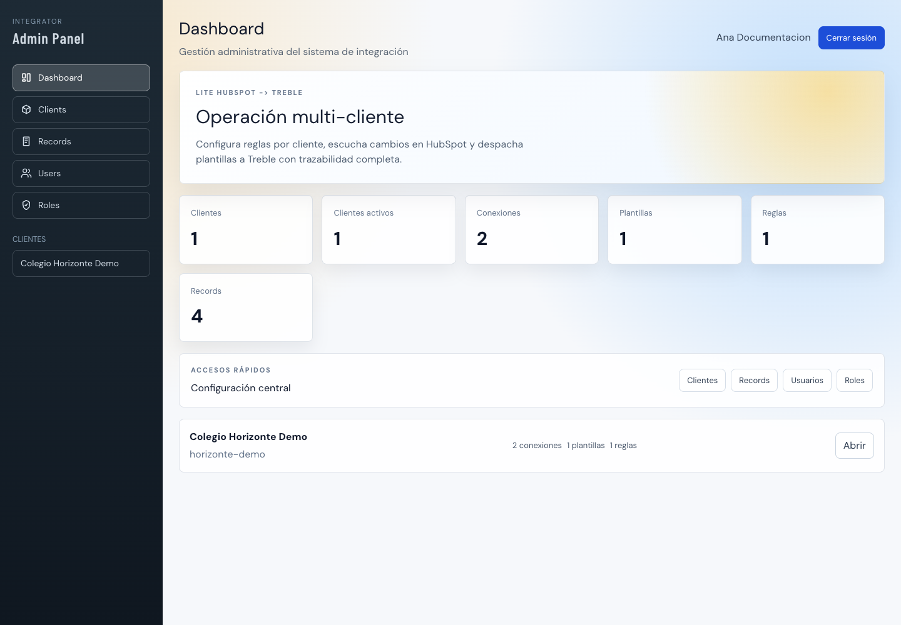
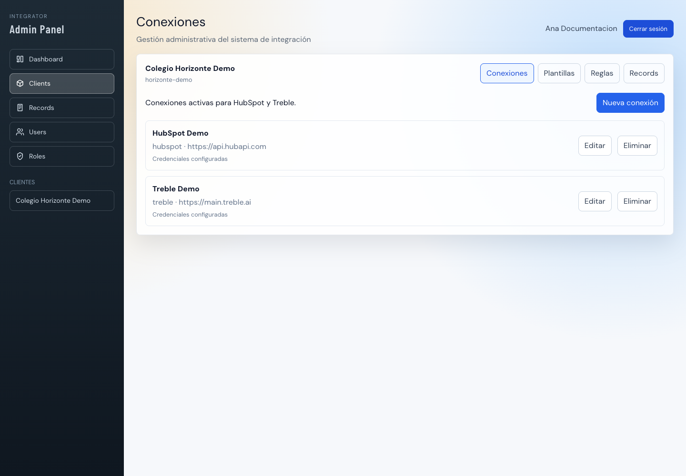
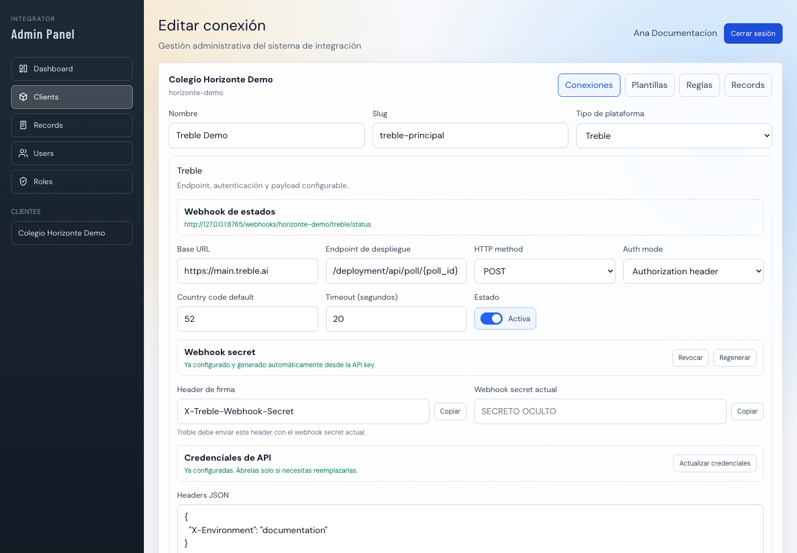
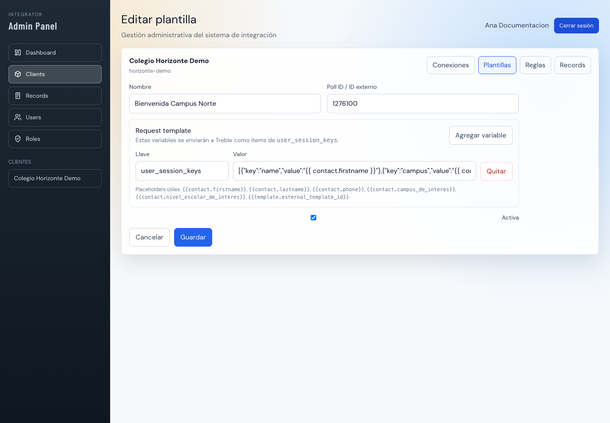
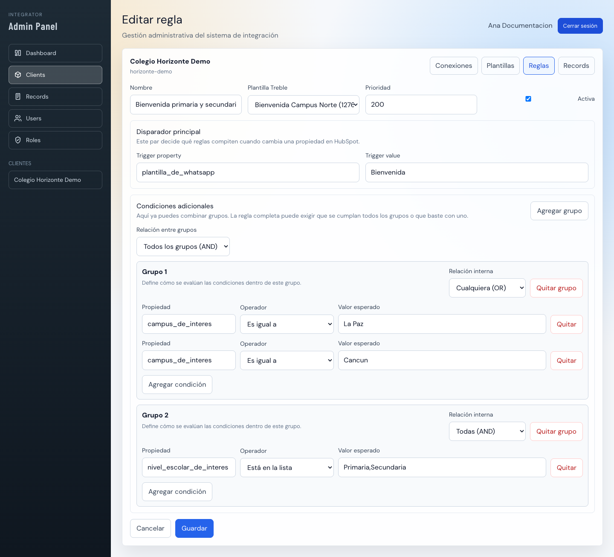
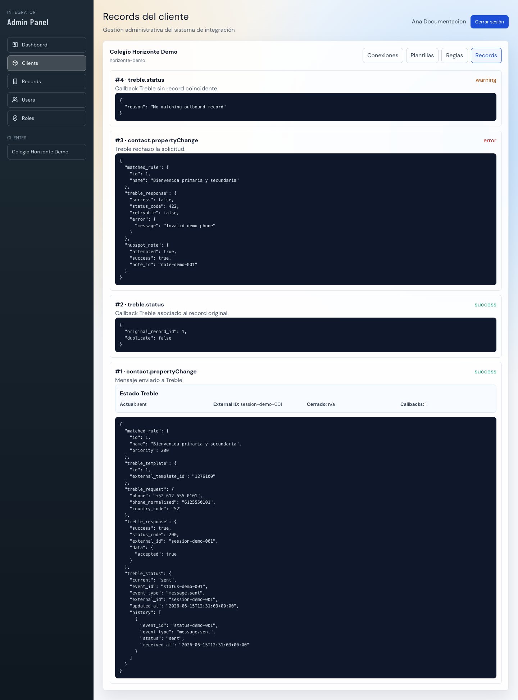

# Manual Integral de Integrador Lite

**Versión documentada:** rama `lite`  
**Audiencia:** administradores, soporte y desarrolladores  
**Flujo principal:** HubSpot → Treble  
**Última revisión:** 15 de junio de 2026

> Este manual describe el comportamiento implementado en la rama Lite. La fuente de verdad utilizada son sus rutas, controladores, modelos, servicios, jobs, migraciones y pruebas de `tests/Feature/Lite`. No debe confundirse con la documentación del integrador completo.

## 1. Propósito y alcance

Integrador Lite es una aplicación multi-cliente que recibe cambios de propiedades de contactos desde HubSpot, obtiene una fotografía actual del contacto, selecciona una regla y una plantilla configuradas para ese cliente, envía el mensaje a Treble y conserva trazabilidad de la solicitud y de sus callbacks.

Cada cliente mantiene de forma independiente:

- una o más conexiones de plataforma;
- una conexión activa de HubSpot y una de Treble para el flujo;
- plantillas Treble;
- reglas de selección;
- records operativos;
- secretos y credenciales cifrados.

### 1.1 Qué sí incluye Lite

- Panel administrativo con clientes, conexiones, plantillas, reglas y records.
- Webhook HubSpot firmado con SHA-256.
- Soporte para payload HubSpot simple o múltiple.
- Procesamiento asíncrono mediante evento, listener y job.
- Consulta de propiedades actuales del contacto en HubSpot.
- Selección por prioridad, disparador exacto y condiciones agrupadas.
- Interpolación de plantillas y envío de `user_session_keys` a Treble.
- Callback de estados Treble, historial e idempotencia por `event_id`.
- Nota operativa en HubSpot cuando falla el envío a Treble.
- Usuarios, roles y permisos.

### 1.2 Qué no incluye Lite

Lite no ofrece los módulos del integrador completo:

- eventos configurables ni flujos arbitrarios de eventos;
- `property_relationships` o pantalla genérica de mapping;
- Odoo, NetSuite, ASPEL ni Azure SQL;
- endpoints HTTP genéricos configurables;
- polling ASPEL;
- sincronización de productos, empresas, facturas o cotizaciones;
- editor de categorías o configuración general del integrador completo.

## 2. Arquitectura y recorrido de una operación

```text
HubSpot
  │ POST /webhooks/{client}/hubspot + firma SHA-256
  ▼
WebhookController
  │ valida cliente, conexión, firma y payload
  ▼
ContactPropertyChangedEvent
  ▼
ContactPropertyChangedListener (ShouldQueue)
  │ solo despacha
  ▼
ProcessContactPropertyChangeJob
  ├─ crea Record inicial
  ├─ obtiene snapshot del contacto en HubSpot
  ├─ resuelve la primera regla válida
  ├─ construye la plantilla y normaliza el teléfono
  ├─ envía el request a Treble
  ├─ actualiza el Record
  └─ ante error intenta crear una nota en HubSpot

Treble
  │ POST /webhooks/{client}/treble/status + secret
  ▼
TrebleStatusWebhookService
  ├─ localiza el Record original
  ├─ evita duplicar el event_id
  ├─ actualiza estado e historial
  └─ crea un Record de callback
```

### 2.1 Responsabilidad por componente

| Componente | Responsabilidad |
|---|---|
| `WebhookController` | Resolver cliente y conexión, validar autenticidad, extraer uno o varios payloads y emitir eventos. |
| `ContactPropertyChangedEvent` | Transportar cliente, conexión y payload. No procesa negocio. |
| `ContactPropertyChangedListener` | Despachar `ProcessContactPropertyChangeJob`. |
| `ProcessContactPropertyChangeJob` | Ejecutar el flujo pesado, registrar trazabilidad y manejar reintentos. |
| `HubspotContactSnapshotService` | Consultar el contacto y agregar notas operativas. |
| `MessageRuleResolver` | Ordenar, normalizar y evaluar reglas. |
| `TrebleService` | Construir headers/payload, interpolar valores y llamar a Treble. |
| `TrebleStatusWebhookService` | Asociar callbacks, mantener estado e historial idempotente. |
| `EventLoggingService` | Crear y actualizar records. |

### 2.2 Cola y reintentos

El listener implementa `ShouldQueue` y no contiene procesamiento pesado. El job usa:

- `tries = 3`;
- `timeout = 120` segundos;
- backoff de 30, 120 y 300 segundos.

En producción debe existir al menos un worker de Laravel Queue activo. Si no hay worker, el webhook puede responder correctamente y aun así el mensaje no avanzará.



## 3. Acceso, usuarios, roles y permisos

El panel requiere autenticación. Puede iniciarse sesión con email o username.

### 3.1 Campos de usuario

| Campo | Uso |
|---|---|
| Username | Identificador alternativo para iniciar sesión. |
| Nombre | Nombre visible o nombre completo. |
| Nombre(s) / apellidos | Identidad desglosada cuando se utiliza en el formulario. |
| Email | Identificador de acceso y contacto administrativo. |
| Contraseña | Se guarda con hash; nunca debe documentarse ni compartirse. |
| Roles | Conjunto de roles asignados al usuario. |

### 3.2 Roles iniciales

| Rol | Acceso esperado |
|---|---|
| `superadmin` | Bypass global de permisos y administración completa. |
| `admin` | Todos los permisos sembrados por el seeder. |
| `operator` | `dashboard.view` y `records.view`. |
| `viewer` | `dashboard.view` y `records.view`. |

### 3.3 Permisos Lite relevantes

| Permiso | Módulo |
|---|---|
| `dashboard.view` | Dashboard. |
| `records.view` | Records globales y por cliente. |
| `clients.manage` | Alta, edición y baja de clientes. |
| `integrations.manage` | Conexiones, plantillas y reglas. |
| `users.manage` | Usuarios. |
| `roles.manage` | Roles y permisos. |

El seeder conserva algunos permisos heredados, pero su presencia no significa que los módulos del integrador completo estén disponibles en Lite.

## 4. Clientes

El cliente es la frontera de aislamiento funcional. Las URLs de webhook usan su `slug` y toda conexión, plantilla, regla o record se relaciona con su `client_id`.

### 4.1 Campos del formulario

| Campo | Obligatorio | Descripción |
|---|---:|---|
| Nombre | Sí | Nombre visible en dashboard, navegación y listados. |
| Slug | Sí | Identificador único y estable usado en las URLs de webhook. Se recomienda minúsculas, números y guiones. |
| Descripción | No | Contexto operativo del cliente. |
| Activo | Sí | Habilita o deshabilita al cliente. Un cliente inactivo no debe recibir operaciones. |

### 4.2 Alta recomendada

1. Crear el cliente.
2. Conservar el slug definitivo; cambiarlo obliga a actualizar ambos webhooks externos.
3. Crear la conexión HubSpot.
4. Crear la conexión Treble.
5. Crear al menos una plantilla activa.
6. Crear una regla activa.
7. Validar con un contacto de prueba.

## 5. Conexiones de plataforma

Las conexiones se administran dentro del cliente. Lite usa `platform_type = hubspot` y `platform_type = treble`.

Los campos `credentials` y `webhook_secret` usan casts cifrados de Laravel. Además se ocultan durante la serialización normal del modelo. La seguridad depende de proteger `APP_KEY`, la base de datos y los respaldos.



### 5.1 Campos comunes

| Campo | Descripción |
|---|---|
| Nombre | Etiqueta visible de la conexión. |
| Slug | Identificador único dentro del cliente. |
| Tipo de plataforma | `HubSpot` o `Treble`. |
| Base URL | Host base del API externo. |
| Estado | Solo las conexiones activas participan en el flujo. |
| Timeout | Tiempo máximo de espera para el request externo. |

## 6. Conexión HubSpot

### 6.1 Campos

| Campo | Descripción |
|---|---|
| Base URL | Normalmente `https://api.hubapi.com`. |
| Access token | Private App Access Token usado para consultar contactos y crear notas. Se almacena cifrado. |
| Webhook secret | Secreto compartido para verificar la firma entrante. Se almacena cifrado. |
| Signature header | Header donde Lite busca la firma. También puede recibirse como query parameter con el mismo nombre. |
| Contact properties | Lista adicional de propiedades que debe incluir el snapshot. |
| Timeout | Límite para llamadas al API de HubSpot. |
| Activa | Habilita la conexión. |

### 6.2 Propiedades consultadas

El job incluye como base:

- `firstname`;
- `lastname`;
- `phone`;
- `mobilephone`;
- `campus_de_interes`;
- `nivel_escolar_de_interes`;
- `plantilla_de_whatsapp`.

Después agrega las propiedades configuradas en `settings.contact_properties`, elimina duplicados y consulta el contacto por su `objectId`.

Toda propiedad empleada en condiciones o placeholders debe estar presente en esta lista base o en la configuración adicional.

### 6.3 Firma SHA-256

La firma esperada se calcula sobre el cuerpo crudo:

```text
hash_sha256(webhook_secret + raw_request_body)
```

Ejemplo conceptual:

```php
$signature = hash('sha256', $secret . $rawBody);
```

Lite compara con `hash_equals`. Una firma ausente o incorrecta devuelve HTTP 401 y no emite el evento.

### 6.4 Rotación del secreto HubSpot

La pantalla permite actualizar el secreto guardado. La rotación debe coordinarse:

1. Preparar el secreto nuevo.
2. Actualizar el origen que firma el webhook.
3. Actualizar Lite en la misma ventana de cambio.
4. Enviar un webhook de prueba.
5. Confirmar ausencia de HTTP 401.

## 7. Conexión Treble



### 7.1 Campos

| Campo | Descripción |
|---|---|
| Base URL | Host de Treble, por ejemplo `https://main.treble.ai`. |
| Endpoint de despliegue | Ruta que admite `{poll_id}`; se sustituye con `external_template_id`. |
| HTTP method | La interfaz Lite utiliza `POST` para el envío implementado. |
| Auth mode | Estrategia de autenticación de salida. |
| API key header | Nombre del header cuando se usa `header_api_key`; default `X-API-Key`. |
| API key | Token de Treble, cifrado. |
| Username / password | Credenciales para `basic_auth`, cifradas. |
| Country code default | Código sin signo `+`, por ejemplo `52`. |
| Timeout | Tiempo máximo del request. |
| Headers JSON | Headers adicionales no sensibles. No duplicar `Content-Type` o credenciales. |
| Signature header | Header esperado en el callback de estado. Default `X-Treble-Webhook-Secret`. |
| Webhook secret | Token compartido del callback, cifrado. |
| Activa | Habilita el uso de la conexión. |

### 7.2 Modos de autenticación

| Modo | Header resultante |
|---|---|
| `authorization_header` | `Authorization: <api_key>` |
| `bearer_api_key` | `Authorization: Bearer <api_key>` |
| `header_api_key` | `<api_key_header>: <api_key>` |
| `basic_auth` | `Authorization: Basic base64(username:password)` |

`Content-Type: application/json` se agrega al request.

### 7.3 Teléfono y country code

Lite separa el teléfono en:

- `country_code`: el valor configurado, por ejemplo `52`;
- `cellphone`: solo dígitos, sin el código de país inicial ni ceros iniciales.

Un teléfono como `+52 612 555 0101` produce:

```json
{
  "country_code": "52",
  "cellphone": "6125550101"
}
```

Si no hay teléfono utilizable, el flujo termina con error antes del envío.

### 7.4 Secreto del callback

Cuando se guarda una API key Treble y no existe un secreto explícito, Lite puede generar automáticamente un secreto de webhook y asignar el header por defecto.

- **Regenerar:** crea un secreto nuevo. El callback externo debe actualizarse de inmediato.
- **Revocar:** elimina el secreto; los callbacks dejan de autenticarse hasta configurar uno nuevo.
- **Copiar:** se usa únicamente durante la configuración segura del emisor.

Nunca incluya el secreto en tickets, capturas o logs.

## 8. Plantillas Treble

Una plantilla pertenece a un cliente y puede ser seleccionada por varias reglas.



### 8.1 Campos

| Campo | Descripción |
|---|---|
| Nombre | Etiqueta administrativa. |
| Poll ID / ID externo | `external_template_id`; reemplaza `{poll_id}` en el endpoint Treble. |
| Request template | Configuración actual de variables enviadas como `user_session_keys`. |
| Payload mapping | Formato legacy todavía soportado por el servicio. |
| Activa | Una regla solo puede resolver una plantilla activa. |

### 8.2 Formato actual

```json
{
  "user_session_keys": [
    {
      "key": "name",
      "value": "{{ contact.firstname }}"
    },
    {
      "key": "campus",
      "value": "{{ contact.campus_de_interes }}"
    },
    {
      "key": "school_level",
      "value": "{{ contact.nivel_escolar_de_interes }}"
    }
  ]
}
```

El formulario representa cada entrada como pareja llave/valor. Si `request_template` está vacío, el servicio intenta usar `payload_mapping` por compatibilidad.

### 8.3 Placeholders

| Namespace | Ejemplos | Origen |
|---|---|---|
| `contact.*` | `{{ contact.firstname }}`, `{{ contact.phone }}` | Snapshot actual de HubSpot. |
| `template.*` | `{{ template.id }}`, `{{ template.name }}`, `{{ template.external_template_id }}` | Plantilla resuelta. |
| `context.*` | `{{ context.object_id }}`, `{{ context.property_name }}` | Contexto técnico proporcionado por el job. |

Reglas de interpolación:

- se acepta espacio alrededor de la ruta;
- una ruta inexistente se convierte en cadena vacía;
- un arreglo u objeto se serializa como JSON;
- los valores resultantes se envían como texto.

### 8.4 Payload final Treble

```json
{
  "users": [
    {
      "cellphone": "6125550101",
      "country_code": "52",
      "user_session_keys": [
        {
          "key": "name",
          "value": "Carla"
        },
        {
          "key": "campus",
          "value": "La Paz"
        }
      ]
    }
  ]
}
```

## 9. Reglas de mensaje

Las reglas deciden qué plantilla se envía. Solo compiten las reglas activas del mismo cliente cuya plantilla también está activa.



### 9.1 Campos

| Campo | Descripción |
|---|---|
| Nombre | Etiqueta operativa de la regla. |
| Plantilla Treble | Plantilla enviada si la regla gana. |
| Prioridad | Orden descendente. En empate se usa el ID ascendente. |
| Activa | Incluye o excluye la regla del resolver. |
| Trigger property | Nombre exacto de la propiedad cambiada en HubSpot. |
| Trigger value | Valor exacto que debe traer el evento. |
| Relación entre grupos | `all` exige todos los grupos; `any` acepta uno. |
| Relación interna | `all` exige todas las condiciones del grupo; `any` acepta una. |
| Propiedad | Propiedad del snapshot del contacto. |
| Operador | Comparación aplicada. |
| Valor esperado | Referencia de comparación; no aplica a vacío/no vacío. |

### 9.2 Orden de selección

1. Filtrar por cliente, regla activa y plantilla activa.
2. Ordenar prioridad de mayor a menor.
3. En empate ordenar por ID ascendente.
4. Comparar `trigger_property`.
5. Comparar `trigger_value` de forma exacta después de `trim`.
6. Evaluar grupos y condiciones.
7. Seleccionar la primera regla válida.

No se combinan varias reglas ni se envían varias plantillas para el mismo evento.

### 9.3 Operadores

| Operador | Comportamiento |
|---|---|
| `equals` | Igualdad textual exacta. |
| `not_equals` | Desigualdad textual. |
| `contains` | El valor actual contiene el esperado, sin distinguir mayúsculas. |
| `not_contains` | El valor actual no contiene el esperado. |
| `in` | El valor actual aparece en una lista separada por comas. |
| `not_in` | El valor actual no aparece en la lista. |
| `is_empty` | El valor actual es vacío. |
| `is_not_empty` | El valor actual no es vacío. |

Para `in` y `not_in`, se recomienda una lista limpia como `Primaria,Secundaria`, sin valores duplicados.

### 9.4 Ejemplo de grupos

```json
{
  "match": "all",
  "groups": [
    {
      "match": "any",
      "rules": [
        {
          "property": "campus_de_interes",
          "operator": "equals",
          "value": "La Paz"
        },
        {
          "property": "campus_de_interes",
          "operator": "equals",
          "value": "Cancun"
        }
      ]
    },
    {
      "match": "all",
      "rules": [
        {
          "property": "nivel_escolar_de_interes",
          "operator": "in",
          "value": "Primaria,Secundaria"
        }
      ]
    }
  ]
}
```

La regla coincide si el campus es La Paz o Cancun **y**, además, el nivel está en la lista.

### 9.5 Compatibilidad legacy

El resolver normaliza:

- formato actual con `match` y `groups`;
- wrapper con `rules`;
- lista directa de condiciones;
- objeto legacy propiedad/valor;
- operadores ausentes, que se interpretan como `equals`.

La interfaz siempre debe guardar el formato agrupado actual. La compatibilidad existe para datos previamente almacenados, no como recomendación para nuevas reglas.

## 10. Records y trazabilidad

Los records permiten reconstruir qué recibió Lite, qué regla seleccionó, qué envió y qué respondió cada plataforma.



### 10.1 Campos principales

| Campo | Descripción |
|---|---|
| `client_id` | Cliente propietario. |
| `record_id` | Record padre, usado para relacionar callbacks u operaciones derivadas. |
| `event_id` | Referencia opcional histórica; no confundir con `event_id` del callback Treble. |
| `event_type` | Tipo operativo, por ejemplo `contact.propertyChange` o `treble.status`. |
| `status` | Estado del procesamiento. |
| `payload` | Payload recibido. |
| `message` | Resumen legible. |
| `details` | Evidencia técnica estructurada. |

### 10.2 Estados observados

| Estado | Significado |
|---|---|
| `init` | El job creó el record y comenzó a procesar. |
| `processing` | Existe trabajo en curso cuando el servicio lo utiliza. |
| `success` | El envío o callback fue procesado correctamente. |
| `warning` | El callback fue válido, pero no pudo asociarse a un envío. |
| `error` | Falló validación, snapshot, regla, teléfono o request externo. |

### 10.3 Detalles de un envío

`details` puede contener:

- `matched_rule`: ID, nombre y prioridad;
- `treble_template`: ID local e ID externo;
- `treble_request`: teléfono original, normalizado y country code;
- `treble_response`: estado HTTP, `external_id`, datos o error;
- `contact_properties`: snapshot utilizado;
- `hubspot_note`: resultado de crear la nota de fallo;
- `treble_status`: último estado y su historial.

### 10.4 Respuesta Treble normalizada

En éxito, el servicio intenta encontrar `external_id` en este orden:

1. `external_id`;
2. `session.external_id`;
3. `data.external_id`;
4. `data.session.external_id`;
5. `data.id`;
6. `message_id`.

Los errores 408, 409, 425, 429, 500, 502, 503 y 504, además de errores sin status, se consideran potencialmente reintentables.

### 10.5 Nota de error en HubSpot

Si Treble falla durante un flujo de contacto, el job intenta agregar una nota al contacto afectado. El resultado queda en:

```json
{
  "hubspot_note": {
    "attempted": true,
    "success": true,
    "note_id": "..."
  }
}
```

La nota es un mecanismo de observabilidad. Su propio fallo no debe ocultar el error original de Treble.

### 10.6 Callback e historial

El callback actualiza `details.treble_status`:

```json
{
  "current": "session.close",
  "event_id": "evt-123",
  "event_type": "session.close",
  "external_id": "ext-123",
  "closed_at": "2026-06-15T12:00:00Z",
  "last_payload": {},
  "updated_at": "2026-06-15T12:00:00Z",
  "history": []
}
```

La búsqueda del record original usa:

1. `external_id` de Treble;
2. si no existe, teléfono normalizado;
3. opcionalmente nombre de HSM o plantilla.

El mismo `event_id` no se agrega dos veces al historial. Aun cuando no haya coincidencia se crea un record `warning` visible.

## 11. Contrato del webhook HubSpot

### 11.1 Endpoint

```http
POST /webhooks/{client}/hubspot
```

`{client}` es el slug.

### 11.2 Headers

```http
Content-Type: application/json
X-Lite-Signature: <sha256(secret + raw_body)>
```

El nombre real del header depende de `signature_header`.

### 11.3 Payload simple

```json
{
  "subscriptionType": "contact.propertyChange",
  "objectId": "987654321",
  "propertyName": "plantilla_de_whatsapp",
  "propertyValue": "Bienvenida",
  "eventId": "demo-event-001",
  "occurredAt": 1781524800000
}
```

### 11.4 Payload múltiple

Se acepta una lista directa:

```json
[
  {
    "subscriptionType": "contact.propertyChange",
    "objectId": "987654321",
    "propertyName": "plantilla_de_whatsapp",
    "propertyValue": "Bienvenida"
  },
  {
    "subscriptionType": "contact.propertyChange",
    "objectId": "987654322",
    "propertyName": "plantilla_de_whatsapp",
    "propertyValue": "Seguimiento"
  }
]
```

También se extraen colecciones bajo `data`, `items`, `results`, `objects`, `records` o `entities`.

### 11.5 Respuestas y errores

| HTTP | Situación |
|---:|---|
| 200 | Payload aceptado y eventos emitidos. |
| 401 | Firma ausente o inválida. |
| 404 | Cliente o conexión no disponible según resolución de ruta/configuración. |
| 422 | JSON o estructura no procesable cuando aplica validación. |

La respuesta 200 confirma recepción, no necesariamente envío final; la ejecución continúa en cola.

## 12. Contrato del callback Treble

### 12.1 Endpoint

```http
POST /webhooks/{client}/treble/status
```

### 12.2 Autenticación

```http
X-Treble-Webhook-Secret: <webhook_secret>
```

El header puede personalizarse. También puede enviarse como query parameter con el mismo nombre.

### 12.3 Payload mínimo

```json
{
  "event_id": "status-demo-001",
  "event_type": "message.sent",
  "external_id": "session-demo-001",
  "status": "sent"
}
```

`event_id` y `event_type` son obligatorios.

### 12.4 Callback exitoso

```json
{
  "event_id": "status-demo-002",
  "event_type": "session.close",
  "external_id": "session-demo-001",
  "status": "closed",
  "closed_at": "2026-06-15T12:45:00Z",
  "phone": "+52 612 555 0101",
  "hsm": {
    "name": "Bienvenida Campus Norte"
  }
}
```

### 12.5 Respuestas y errores

| HTTP | Situación |
|---:|---|
| 200 | Callback autenticado, procesado y registrado; puede estar asociado o quedar como warning. |
| 401 | Secret ausente o incorrecto. |
| 422 | Falta `event_id` o `event_type`. |

## 13. Demo integral

Todos los valores siguientes son sintéticos.

### 13.1 Alta de cliente

```text
Nombre: Colegio Horizonte Demo
Slug: horizonte-demo
Descripción: Cliente sintético para pruebas y documentación.
Activo: sí
```

### 13.2 Alta HubSpot

```text
Nombre: HubSpot Demo
Slug: hubspot-principal
Base URL: https://api.hubapi.com
Signature header: X-Lite-Signature
Contact properties:
  firstname
  lastname
  phone
  campus_de_interes
  nivel_escolar_de_interes
  plantilla_de_whatsapp
```

Configurar por canal seguro el token y el webhook secret.

### 13.3 Alta Treble

```text
Nombre: Treble Demo
Slug: treble-principal
Base URL: https://main.treble.ai
Endpoint: /deployment/api/poll/{poll_id}
Método: POST
Auth mode: authorization_header
Country code: 52
Status header: X-Treble-Webhook-Secret
```

### 13.4 Plantilla

```text
Nombre: Bienvenida Campus Norte
Poll ID: 1276100
Variables:
  name = {{ contact.firstname }}
  campus = {{ contact.campus_de_interes }}
  school_level = {{ contact.nivel_escolar_de_interes }}
```

### 13.5 Regla

```text
Nombre: Bienvenida primaria y secundaria
Prioridad: 200
Trigger: plantilla_de_whatsapp = Bienvenida
Entre grupos: ALL
Grupo 1: campus = La Paz OR campus = Cancun
Grupo 2: nivel in Primaria,Secundaria
```

### 13.6 Webhook entrante

```json
{
  "subscriptionType": "contact.propertyChange",
  "objectId": "987654321",
  "propertyName": "plantilla_de_whatsapp",
  "propertyValue": "Bienvenida",
  "eventId": "demo-event-001"
}
```

### 13.7 Snapshot esperado

```json
{
  "id": "987654321",
  "properties": {
    "firstname": "Carla",
    "lastname": "Ejemplo",
    "phone": "+52 612 555 0101",
    "campus_de_interes": "La Paz",
    "nivel_escolar_de_interes": "Primaria",
    "plantilla_de_whatsapp": "Bienvenida"
  }
}
```

### 13.8 Request Treble

```json
{
  "users": [
    {
      "cellphone": "6125550101",
      "country_code": "52",
      "user_session_keys": [
        {
          "key": "name",
          "value": "Carla"
        },
        {
          "key": "campus",
          "value": "La Paz"
        },
        {
          "key": "school_level",
          "value": "Primaria"
        }
      ]
    }
  ]
}
```

### 13.9 Callback exitoso y duplicado

Primer envío:

```json
{
  "event_id": "status-demo-001",
  "event_type": "message.sent",
  "external_id": "session-demo-001",
  "status": "sent"
}
```

Si Treble reenvía exactamente el mismo callback, Lite responde correctamente, crea la evidencia de recepción que corresponda y no vuelve a añadir `status-demo-001` al historial del record original.

### 13.10 Fallo con nota HubSpot

Ante un HTTP 422 de Treble:

1. el record cambia a `error`;
2. `treble_response` guarda status y error sanitizado;
3. el job intenta crear una nota en el contacto;
4. `details.hubspot_note` conserva el resultado;
5. soporte puede revisar el fallo desde Records y desde HubSpot.

## 14. Runbook de instalación y operación

### 14.1 Requisitos

- PHP compatible con el proyecto.
- Composer y dependencias instaladas.
- Node.js y assets frontend compilados.
- Base de datos configurada.
- Un driver de cola.
- Acceso saliente HTTPS a HubSpot y Treble.
- `APP_KEY` estable y respaldada de forma segura.

### 14.2 Migraciones y roles

```bash
php artisan migrate --force
php artisan db:seed --class=Database\\Seeders\\RolesAndPermissionsSeeder --force
```

Debe existir un usuario administrador con rol `superadmin` o `admin`.

### 14.3 Seeder operativo de cliente

El comando disponible es:

```bash
php artisan lite:seed-client \
  --slug=acme \
  --name="Cliente ACME" \
  --hubspot-token="..." \
  --hubspot-secret="..." \
  --hubspot-base-url="https://api.hubapi.com" \
  --hubspot-signature="x-signature" \
  --treble-base-url="https://main.treble.ai" \
  --treble-send-path="/deployment/api/poll/{poll_id}" \
  --treble-auth-mode="authorization_header" \
  --treble-api-key="..."
```

Opciones soportadas:

| Opción | Uso |
|---|---|
| `--slug` | Slug del cliente. |
| `--name` | Nombre visible. |
| `--hubspot-token` | Access token HubSpot. |
| `--hubspot-secret` | Secreto de firma. |
| `--hubspot-base-url` | Base URL HubSpot. |
| `--hubspot-signature` | Header de firma. |
| `--treble-base-url` | Base URL Treble. |
| `--treble-send-path` | Endpoint con `{poll_id}`. |
| `--treble-auth-mode` | Modo de autenticación. |
| `--treble-api-key` | API key Treble. |
| `--inactive-treble` | Crea Treble inactivo si aún no hay credenciales. |

Evite poner secretos en historial de shell. Para producción, prefiera variables temporales, secretos del orquestador o captura interactiva controlada.

### 14.4 Worker

```bash
php artisan queue:work --tries=3 --timeout=120
```

En un supervisor de procesos, reinicie workers después de desplegar:

```bash
php artisan queue:restart
```

### 14.5 Pruebas Lite

```bash
php artisan test tests/Feature/Lite
```

Las pruebas cubren:

- rechazo de firma inválida;
- flujo exitoso y record;
- prioridad y grupos de reglas;
- nota HubSpot en error Treble;
- registro único del listener;
- pantallas y permisos;
- persistencia de conexión;
- autenticación y request template Treble;
- callback, matching, warning e idempotencia.

## 15. Diagnóstico

### 15.1 El webhook devuelve 401

- Confirmar cliente y slug.
- Confirmar conexión HubSpot activa.
- Confirmar nombre exacto del header.
- Calcular la firma con el cuerpo crudo, sin reformatear JSON.
- Confirmar que emisor y Lite usan el mismo secreto.

### 15.2 Hay 200 pero no aparece record

- Verificar que el worker esté activo.
- Revisar la conexión de cola y `failed_jobs`.
- Confirmar registro único del listener.
- Revisar logs de Laravel.

### 15.3 Aparece record pero no hay regla

- Comparar exactamente `trigger_property` y `trigger_value`.
- Confirmar prioridad y estado.
- Confirmar que la plantilla esté activa.
- Verificar que todas las propiedades de condiciones se consulten en el snapshot.
- Revisar relaciones `all/any`.

### 15.4 Treble rechaza el request

- Revisar `auth_mode`.
- Revisar base URL y `send_path`.
- Confirmar `external_template_id`.
- Revisar `treble_request` y teléfono normalizado.
- Confirmar llaves requeridas por la plantilla.
- Revisar status y error en `treble_response`.

### 15.5 Callback queda en warning

- Confirmar que Treble envíe `external_id`.
- Comparar con `details.treble_response.external_id`.
- Si no hay external ID, revisar teléfono y country code.
- Confirmar que el callback pertenece al mismo cliente.
- Revisar nombre de HSM/plantilla cuando se utiliza como filtro.

### 15.6 Callback devuelve 422

Agregar `event_id` y `event_type`. Ambos son obligatorios.

## 16. Checklist de puesta en marcha

- [ ] Migraciones ejecutadas.
- [ ] Roles y permisos sembrados.
- [ ] Usuario administrador creado.
- [ ] `APP_KEY` protegida y respaldada.
- [ ] Cliente activo con slug definitivo.
- [ ] Conexión HubSpot activa.
- [ ] Token HubSpot probado.
- [ ] Firma HubSpot validada con el cuerpo crudo.
- [ ] Propiedades de reglas y plantillas incluidas en el snapshot.
- [ ] Conexión Treble activa.
- [ ] Auth mode Treble confirmado.
- [ ] Country code y normalización telefónica validados.
- [ ] Secreto de callback Treble configurado.
- [ ] Plantilla activa con Poll ID correcto.
- [ ] Regla activa y prioridad revisada.
- [ ] Worker supervisado y reiniciable.
- [ ] Webhook simple probado.
- [ ] Webhook múltiple probado.
- [ ] Request Treble confirmado.
- [ ] Callback exitoso confirmado.
- [ ] Callback duplicado probado.
- [ ] Error Treble y nota HubSpot verificados.
- [ ] Records visibles para soporte.
- [ ] Capturas y tickets libres de secretos y datos personales.

## 17. Referencia de código

| Área | Archivo principal |
|---|---|
| Rutas web | `routes/web.php` |
| Rutas webhook | `routes/webhooks.php` |
| Entrada webhook | `app/Http/Controllers/WebhookController.php` |
| Evento | `app/Events/HubSpot/ContactPropertyChangedEvent.php` |
| Listener | `app/Listeners/HubSpot/ContactPropertyChangedListener.php` |
| Job | `app/Jobs/HubSpot/ProcessContactPropertyChangeJob.php` |
| Snapshot HubSpot | `app/Services/Hubspot/HubspotContactSnapshotService.php` |
| Reglas | `app/Services/Lite/MessageRuleResolver.php` |
| Envío Treble | `app/Services/Treble/TrebleService.php` |
| Callback Treble | `app/Services/Treble/TrebleStatusWebhookService.php` |
| Modelos Lite | `app/Models/Client.php`, `PlatformConnection.php`, `TrebleTemplate.php`, `MessageRule.php`, `Record.php` |
| Admin | `app/Http/Controllers/Admin/*` y `resources/js/Pages/Admin/*` |
| Seeder operativo | `app/Console/Commands/LiteSeedClientCommand.php` |
| Pruebas | `tests/Feature/Lite/*` |

---

**Criterio de soporte:** un webhook aceptado solo confirma recepción. Para considerar completa una operación se debe verificar el record final, la respuesta Treble y, cuando aplique, el callback de estado.
